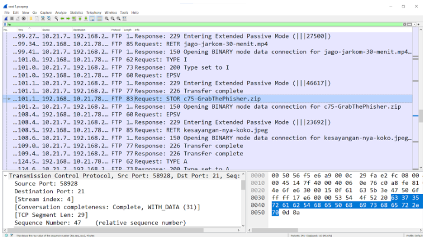
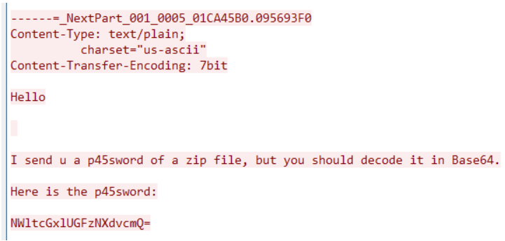
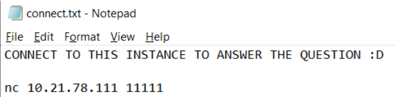
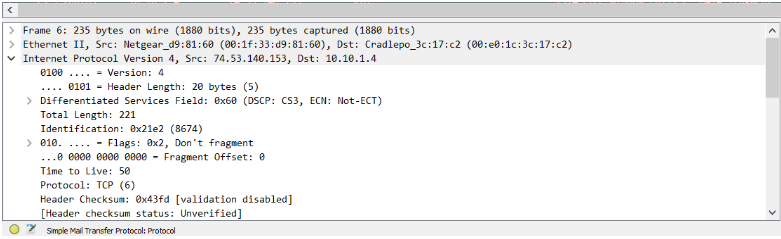
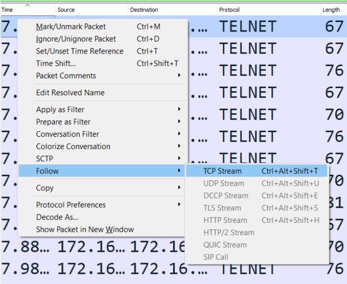

# Laporan Resmi Praktikum Jaringan Komputer - Modul 1 IT20

### Annisa Rahmapuri - 5027211018
### Abdul Zaki Syarul Rahmat - 502721120

## Nomor 1 - Addressing
**Deskripsi** : Pada nomor 1 ini user diminta untuk mencari paket yang mengupload sebuah file dan juga paket yang merupakan respons nya. Kemudian menginputkan sequence number (raw) dan acknowledge number (raw) dari kedua paket tersebut

**Cara Pengerjaan** : 
Untuk melakukan hal tersebut kita dapat melakukan filtering terlebih dahulu pada wireshark untuk mencari paket yang merupakan paket ftp dengan menggunakan query “ftp”. Kemudian kita dapat mencari list paket-paket tersebut. Untuk mempermudah pencarian, paket tersebut dapat diurutkan menurut waktunya secara ascending (dari yang paling awal ke akhir)

Setelah ditelusuri terdapat paket yang menggunakan “STOR”, salah satu perintah dalam protokol FTP untuk mengunggah sebuah file, dan jika diurutkan sesuai dengan waktu (ascending) make paket tepat setelahnya adalah paket respons dari request STOR

Di sebelah sebelah kiri bawah kita dapat membuka bagian TCP. Di bagian tersebut kita dapat menemukan sequence number dan acknowledge number masing-masing paket
- Paket request STOR

- Paket respons

Masukkan jawaban tersebut ke netcat

## Nomor 2 - Stream
**Deskripsi** : User diminta untuk mencari web server yang digunakan melalui file packet capture

**Cara pengerjaan** : 
Pertama-tama, lakukan filtering pada wireshark untuk menampilkan paket http dengan query “http”

Periksa paket yang merupakan respons dari protokol HTTP seperi HTTP 200 dan 403

Dibagian HTTP sebelah kiri bawah, kita dapat menemukan server yang digunakan, yaitu gunicorn (Green Unicorn)

Masukkan jawaban ke netcat

## Soal 3

Dapin sedang belajar analisis jaringan. Bantulah Dapin untuk mengerjakan soal berikut:

1. Berapa banyak paket yang tercapture dengan IP source maupun destination address adalah 239.255.255.250 dengan port 3702? 21 paket
2. Protokol layer transport apa yang digunakan? UDP

### Deskripsi

Pada soal ini, kami diminta untuk meilhat berapa paket dengan IP source maupun destination address adalah 239.255.255.250 dengan port 3702 dan mengetahui protokol layer transport apa yang digunakan. 

### Cara Pengerjaan

- Pertama, mendownload dan membuka file yang tersedia pada wireshark lalu memasukan filter ***ip.addr == 239.255.255.250 and udp.port == 3702***
    - ip.addr == 239.255.255.250 → filter untuk mencari paket-paket yang memiliki alamat IP sumber (ip.src) atau alamat IP tujuan (ip.dst) 239.255.255.250
    - **udp.port == 3702 →** filter untuk port UDP sumber (udp.srcport) atau port UDP tujuan (udp.dstport) 3702.
        
         
        
- Hasil yang didapat adalah 21 paket dengan protokol UDP

### Dokumentasi

## Soal 4

Berapa nilai checksum yang didapat dari header pada paket nomor 130?

### Deskripsi

Pada soal ini, kami diminta untuk mengecheck nilai checksum pada eader paket nomor 130

### Cara Pengerjaan

- Pertama, mendownload dan membuka file yang tersedia pada wireshark
- Check detail header pada paket nomor 130, checksum berada pada detail User Datagram Protocol dengan nilai 0x18e5
    
    
    

### Dokumentasi

## Nomor 5 - Analysis
**Deskripsi** : Pada kategori Analisis nomor 5 ini kita diminta untuk menganalisa file packet capture yang diberikan dan mencari beberapa informasi terkait

**Cara pengerjaan** : 
Kita diberikan dua file, satu file zip dan pcap, disini kita akan mencari password dari zip terlebih dahulu yang berada di file pcap. Lakukan filtering untuk menampilkan paket yang menggunakan protokol SMTP dengan query “smtp”

Follow TCP Stream paket-paket tersebut dengan cara klik kanan > Follow > TCP Stream

Setelah ditelusuri, dapat ditemukan password yang masih terenkripsi dengan enkripsi Base64. Kita dapat mendekripsinya menggunakan tools yang ada di internet

Setelah didekripsi, ditemukan password sebagai berikut, password berikut merupakan password dari file zip yang diberikan

File zip tersebut mengandung alamat netcat yang akan kita gunakan nantinya untuk mendapatkan flag

Kembali ke Wireshark, hilangkan filtering yang kita gunakan, maka disebelah kanan bawah akan tampil total paket yang ada

Kemudian disebelah kiri ada keterangan untuk paket SMTP menggunakan port 25

Untuk IP Addressnya dapat dilihat paket SMTP di bagian source nya

Masukkan informasi-informasi tersebut ke nc

## Nomor 6 - Addressing
**Deskripsi** : Pada soal nomor 6 ini kita diminta untuk mencari pesan tersembunyi yang tersimpan di dalam file packet capture

**Cara pengerjaan** : 
Di soal dijelaskan bahwa source address 7812 is invalid. Ini adalah sebuah clue, kita dapat langsung menuju ke paket nomor 7812

Pada soal terdapat hint bahwa “source address adalah kunci” maka kita dapat melihat source IP Address pada paket tersebut yaitu 104.18.14.101

Hint lainnya mengatakan bahwa pesan merupakan pesan cipher dengan tipe a1z26 dengan ketentuan bahwa rentang huruf yang digunakan Huruf A-R, 1-18 dengan jawaban 6 huruf. Jika kita decode dengan petunjuk tersebut, maka akan di dapatkan 10-4.18.14.10-1 atau JDRNJA

Masukkan teks yang sudah di decode kedalam netcat

## Soal 7

Berapa jumlah packet yang menuju IP 184.87.193.88?

### Deskripsi

Pada soal ini, kami diminta untuk menghitung jumlah packet yang menuju IP 184.87.193.88

### Cara Pengerjaan

- Pertama, mendownload dan membuka file yang tersedia pada wireshark lalu memasukan filter ** ip.dst == 184.87.193.88
    - ip.dst == 184.87.193.88 → untuk mencari dan menampilkan paket data yang memiliki alamat tujuan (destination address) 184.87.193.88.
        
        
        
- Setelah terfilter, lihat total displayed packet di pojok kanan bawah. Terdapat 6 paket packet yang menuju IP 184.87.193.88

### Dokumentasi

## Soal 8

Berikan kueri filter sehingga wireshark hanya mengambil semua protokol paket yang menuju port 80! (Jika terdapat lebih dari 1 port, maka urutkan sesuai dengan abjad)

### Deskripsi

Pada soal ini, kami diminta untuk langsung memasukan query filter untuk mengambil semua protokol paket yang menuju port 80! (Jika terdapat lebih dari 1 port, maka urutkan sesuai dengan abjad)

### Cara Pengerjaan

- Query filter yang dimaksud adalah tcp.dstport == 80 || udp.dstport == 80. Di sini, kami mencoba untuk menfilter seluruh paket yang menuju port 80 dengan protokol TCP dan UDP.
    - tcp.dstport == 80 → menampilkan paket-paket yang menuju ke port TCP 80
    - udp.dstport == 80 → menampilkan paket-paket yang menuju ke port UDP 80

### Dokumentasi

## Soal 9

Berikan kueri filter sehingga wireshark hanya mengambil paket yang berasal dari alamat 10.51.40.1 tetapi tidak menuju ke alamat 10.39.55.34!

### Deskripsi

Pada soal ini, kami diminta untuk langsung memasukan query filter untuk mengambil paket yang berasal dari alamat 10.51.40.1 tetapi tidak menuju ke alamat 10.39.55.34

### Cara Pengerjaan

- Query filter yang dimaksud adalah ip.src == 10.51.40.1 && ip.dst != 10.39.55.34. Filter ini berguna untuk memilih semua paket yang memiliki alamat sumber (ip.src) 10.51.40.1 dan alamat tujuan (ip.dst) yang tidak sama dengan 10.39.55.34.

### Dokumentasi

## Nomor 10 - Stream
**Deskripsi** : Pada nomor ini, kita diminta untuk mencari kredensial dari user yang mencoba login melalui protokol telnet

**Cara pengerjaan** : 
Lakukan filtering untuk menampilkan paket yang menggunakan protokol telnet dengan menggunakan query “telnet”

Kemudian kita dapat mem-follow paket-paket tersebut dengan cara klik kanan > follow > TCP Stream

Setelah ditelusuri masing-masing stream dari paket-paket tersebut, di stream terakhir. Jika diperhatikan dengan baik (lihat warna blok dari teksnya) dapat ditemukan username dan password yang diinginkan yaitu dhafin:kesayangannyak0k0

Masukan kredensial tersebut ke netcat

